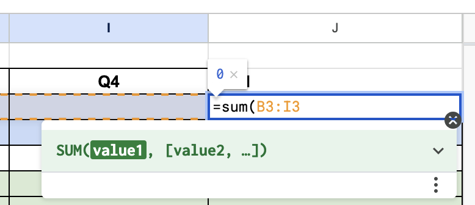

## How to use Google Sheets to take over the world

* Click on an empty cell and type =SUM and select the cells you want to add.
* For multiplication, type =PRODUCT
* You can use these functions to easily do all the addition and multiplication you need in your spreadsheet, without using an external calculator.

## What you need to do for this assignment

* Figure out how much money it will take you to develop the initial app
    * Use the article you read as a guideline
    * Put all of this information into the "Up Front Costs" section. 
* Figure out how much you need to make to pay off this debt in a year.
    * How many users / subscribers / other income do you need?
* What are your ongoing costs?
    * Server costs
    * Marketing (to grow the site)
* Any research that you do ("how much are server costs for an app with 10,000 users?"), put the link into the "Links" tab.
* The "Calculating unit cost" tab is to help you convert from how many subscribers you have to your total revenue from subscribers.
* Put all this information into your spreadsheet and see if you'll break even in a year!
