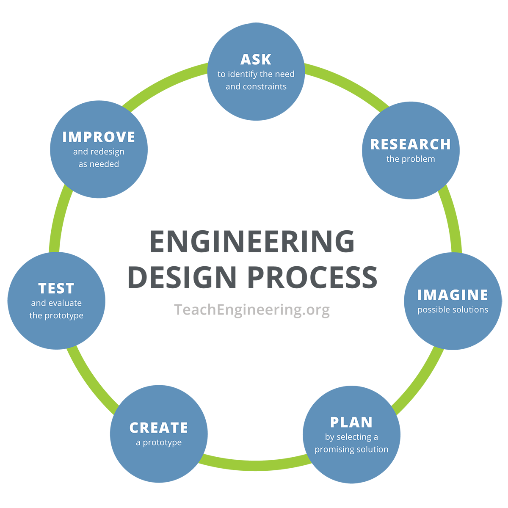

# Day 1 

* Paper airplane lab?
* Syllabus etc
* Repeat kids?
* Introduce engineering cycle in an authentic way
* What do you do if something doesn't work?
* Solution for notebooks? Consequences for not turning in

## Notes on voltage
* Voltage is current times resistance

| Month    | Savings |
| -------- | ------- |
| January  | $250    |
| February | $80     |
| March    | $420    |

## Assignment for today

[assignment](https://classroom.google.com/c/Nzk5ODMwMDc3MDEw/a/ODM2NDQ4OTc1MTgz/details)

## Slides for today

[Slides](https://docs.google.com/presentation/d/1cOS_fU-Tygjq6b4TL0ldor_CktyeMSjrlBwk61HVraY/edit?slide=id.g377ce5bb23d_0_64#slide=id.g377ce5bb23d_0_64)
