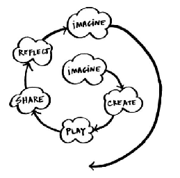

**English/Language Arts Syllabus**  
“You can’t use up creativity. The more you use, the more you have.” \- Maya Angelou

Welcome to English/Language Arts\! In this class we will be reading, discussing, writing about, and making literature. We will journal and discuss ideas as a class, getting to know our classmates and ourselves. It’s going to be super fun\!

In class we will read a wide variety of texts, spanning many decades, genres, and topics, from narrative to nonfiction. We will write a similar range of texts, from informational to journaling to persuasive to narrative. Throughout the class, we will develop two essential skills that will benefit you in all paths of life: empathy and creativity.

**Learning Targets**:  
You can find all of the learning targets online in Empower, but here is a high level view of what we will accomplish:

1. **Reading**—I am able to grow in literacy in reading a wide variety of texts.  
2. **Writing**—I am able to express myself in a wide variety of types of writing.  
3. **Discussion / Participation—**I am able to express myself verbally, listen actively, and work constructively with my classmates. We will be using [Socratic seminar](https://en.wikipedia.org/wiki/Socratic_method#Socratic_Circles) as the model for our discussions.  
4. **Projects**—I can create projects that demonstrate my use of the abilities we have learned in class.

**Late work:**  
If you turn in a piece of work late, you will need to write a note to your teacher, explaining when you will be able to get it turned in. We want to mirror what would happen in “the real world” as closely as possible, and that means you have to advocate for yourself. The sooner you can tell your teacher that you need more time, the better.  
**A note on content \- ELA Class**:

Dear families,

For our first project at STEAD, we plan to read *The Martian*, by Andy Weir.

*The Martian* is a book about a man who gets stranded on Mars and must learn to adapt and survive. We are using it to teach students about resilience and resourcefulness in unfamiliar surroundings, much like the ones they will face in their first days at STEAD.

The book contains some explicit language. If you would like to opt out for a version without the explicit language, we have multiple copies of the “clean” classroom version. We will read the original version by default because the language is more true to the experience of the book, but we will not read the explicit language out loud.

If you would like your student to opt out and read the “clean” version of the book, please email me at [eking@thesteadschool.org](mailto:eking@thesteadschool.org). We hope you are having a great summer and we can’t wait to meet your kids\!

Thank you, 

The STEAD English Department   
Ed King, Ryan Pearse, and Annabel Parker

