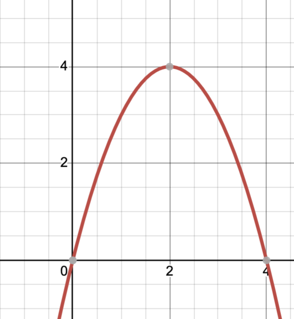

# Energy

## Goal:

* To understand and apply basic energy equations
* To have the correct vocabulary for your writeup
* To think of problems as a mechanical engineer

## Notes

Energy can only change form, not be created or destroyed.

The two kinds of energy we will talk about are **kinetic** and **potential.**

## Engineer

You are a mechanical engineer, tasked with solving the foll

## Kinetic Energy

Energy in movement

 $E_k= \frac{1}{2} mv^2$

 m = mass (kg)

v = velocity (m/s)

## Potential Energy

The kind of potential energy we care about for this project is **elastic potential energy**. This is what builds up when you pull back on a spoon or rubber band.

$E_p = mgh$

m = mass (kilograms)

h = height (meters)

g = gravitational constant ($9.81 \frac{m}{s^2}$)

## Shape 

Objects launched through a gravitational field form the shape of a **parabola.**

A 45º angle will get you max distance.

## Elastic potential energy

$E_\text{elastic} = \tfrac{1}{2} k x^2$

## Distance

When launched at a 45 degree angle, the bean bag will follow the following equation:

$D = \frac{v^2}{g}$

$g = 9.81 \frac{m}{s^2}$

## Your task

Use one of these equations to explain the behavior of your bean bag launcher in your writeup.
