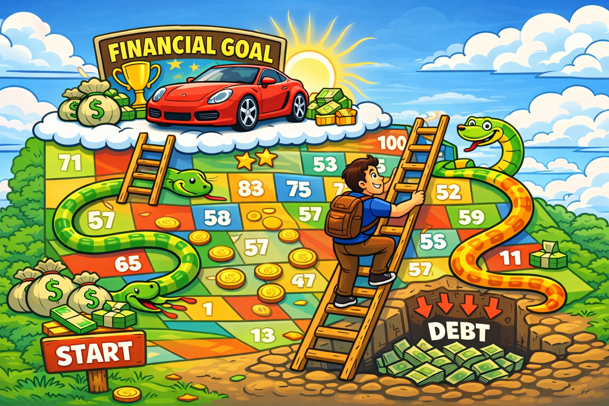

# **Personal Finance Final Project**

## **Your task**

Your task is to make a poster, board-game-style, that shows how you will progress towards a major financial goal in your 20s. 

For an extra challenge, you can make your poster an interactive board game. This, if you complete the other requirements as well, will earn you a 4 on the project.

Your posrter will be a plan to meet your financial goal for the next ten years.

Your path to your goal must include important financial milestones and pitfalls (eating out every night, for instance, or borrowing money on a credit card). 

You can base your board game on Chutes and Ladders, or come up with your own game/system.

## Example goals:

- Buy a house  
- Travel the world  
- Buy the car of your dreams  
- Pay off all your debt  
- Have a successful (side) business 

## **You must include:**

- Elements of your budget from class period #1
- Financial vocabulary from day 1 and day 2
- How to use debt to achieve your goals without falling into a spiral.

## Groups and Deadline

* You may work by yourself, on a small sheet, or in a group of two, on a big sheet.
* We will play / present these next class!

## Rubric

  Standard                       1                                                                 2                                                                                                                                   3                                                                    4
  ------------------------------ ----------------------------------------------------------------- ----------------------------------------------------------------------------------------------------------------------------------- -------------------------------------------------------------------- -------------------------------------------------------------------------------------------------------------------
  KH.1: Self-directed learning   No attempt has been made to depict financial progress or goals.   Vocabulary related to financial goals has been used and understood, but is not applied effectively to solving financial problems.   All of 2, plus financial problems have been analyzed successfully.   Student has created a functioning board game that demonstrates full understanding of financial literacy concepts.
