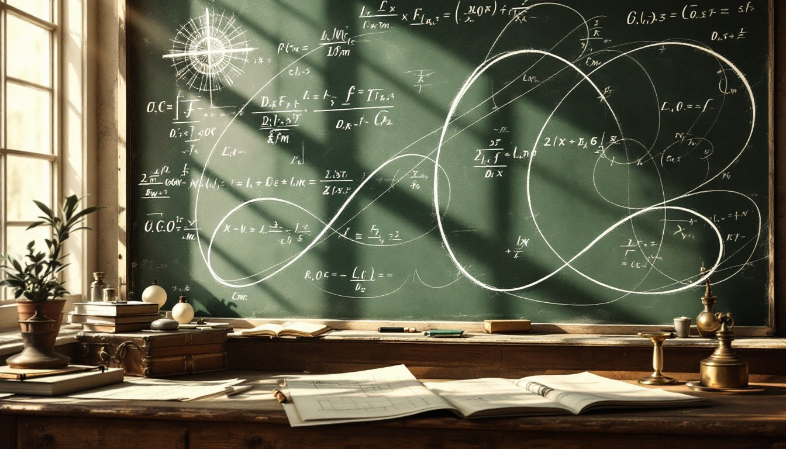

# How Much? How Fast?
### A Unit on the Big Ideas of Calculus

---

## DUE DATES

| | |
|---|---|
| **Tuesday, April 14th** | How Fast? How Much? and Leaky Faucet |

---

## The Two Questions

Everything in this unit comes back to two questions:

- **How fast is something changing?**
- **How much has accumulated so far?**

A speedometer (how fast you are going) answers the first question. An odometer (how many miles you have traveled) answers the second. They're measuring the same trip — just from different angles. One of the big surprises of this unit is that these two questions are actually *inverses of each other*: if you can answer one, you can answer the other.

That relationship is the core idea of calculus.

## Unit roadmap

[Unit roadmap](roadmap.html)

## Things to Notice as You Go

The same idea keeps showing up in new clothes. When you feel like something is new and disconnected, ask yourself:

- *Is there a rate and a total amount here?*
- *Which one do I know, and which one am I trying to find?*
- *What does the area — or the slope — represent in this situation?*

Answering those questions will almost always show you where you are in the unit.

## Schedule

| Date | Class No. | Activities | Notes |
|---|---|---|---|
| 3/31 | 1 | Building the Pyramid 45 How Far Did You Go? 45 |[Solutions](notes-4-1.html) |
| 4/2 | 2 | Another Trip 30 (Enrichment)  How Fast? How Much? 45 Leaky Faucet 15 | [Solutions](how-much.html) | 
| 4/6 | 3 | Graduation Math Portfolios (3 due by end of class) | |
| 4/8 | 4 | Graduation Math Portfolios (3 more due by end of class) | |
| 4/10 | 5 | Continue: Leaky Faucet 15 Reference: Units for Measuring Electricity What's Watt? 30 Electrical Meter 40 | [Leaky Faucet Solutions](img/leaky-faucet.jpg) [What's Watt? Solutions](img/watt.jpg)|
| 4/15 | 6 | Graduation Math Portfolios (Completly due by end of class) | |
| 4/17 | 7 | N/A | SAT/PSAT |
| 4/21 | 8 | Tilted Duct 40 Warming Up 40 | |
| 4/23 | 9 | Total Heat 75 | |
| 4/27 | 10 | A Distance Graph 40 Let It Fall! 30 | (Skip How Fast Were you Going |
| 4/29 | 11 | Pool pockets Basic Derivatives 45 Going Up? 40 | (Skip summer job) |
| 5/1 | 12 | Down the Drain Polynomial Derivatives | |
| 5/5 | 13 | Portfolio Due | |
| 5/7 | 14 | Exam | |
