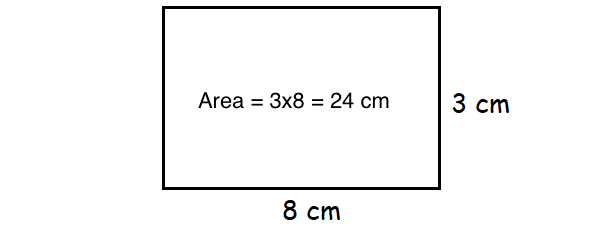
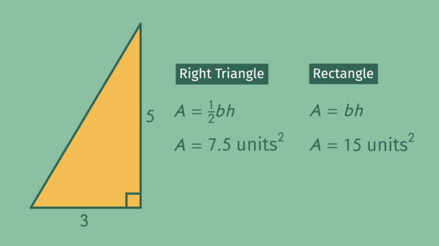
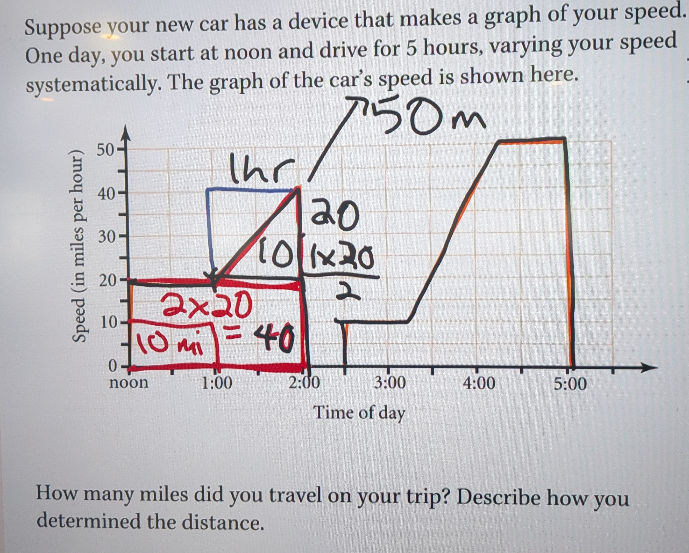
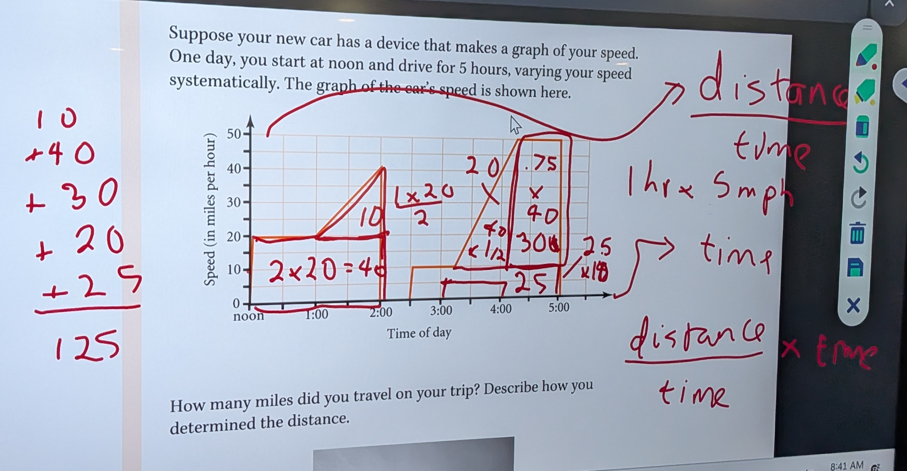

# Necessary pre-skills for the unit

## Finding area of a rectangle

To find the area of a rectangle, multiply its **length** times its **width**.

## Finding area of a triangle

Finding the area of a triangle is the same as finding the area of a rectangle, then cutting it in two. 

# Notes for worksheets

## 3/30/26 How Far Did You Go?

* If you have a graph of speed on the y axis and time on the x axis, the **area** under the lines is the distance traveled.
* Break down the area beneath the lines on the graph into rectangles and triangles.
* Click to zoom in on the ViewBoard notes below:

## 3/30/26 Building the Pyramid
