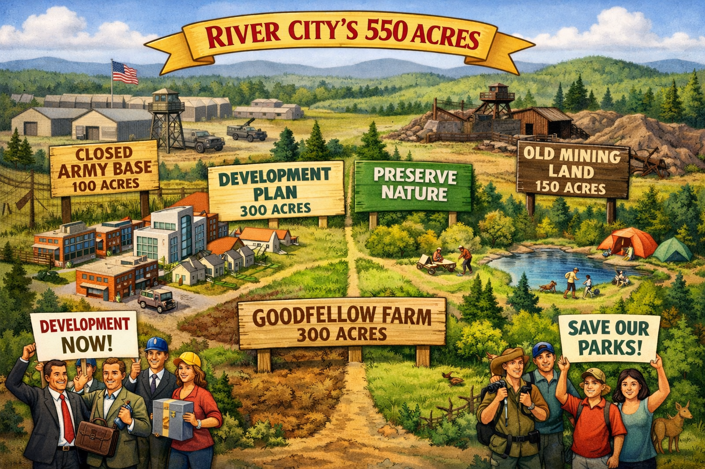

## Links

[Class worksheets](https://drive.google.com/drive/u/1/folders/1CdNnTxJIGEkQ15M1Ewke0CHleM5wnMNO)

## Land

* 300 acre Mr. Goodfellow
* 100 acre Army
* 150 acres mining

## Use

* Recreation/development
* 300 acres for development
* Army base and mine more "attractive"

## Compromise

* At most, 200 acres of the army base and mining land will be used for recreation.
* The amount of army base land used for recreation and the amount of farmland used for development together must total exactly 100 acres.

