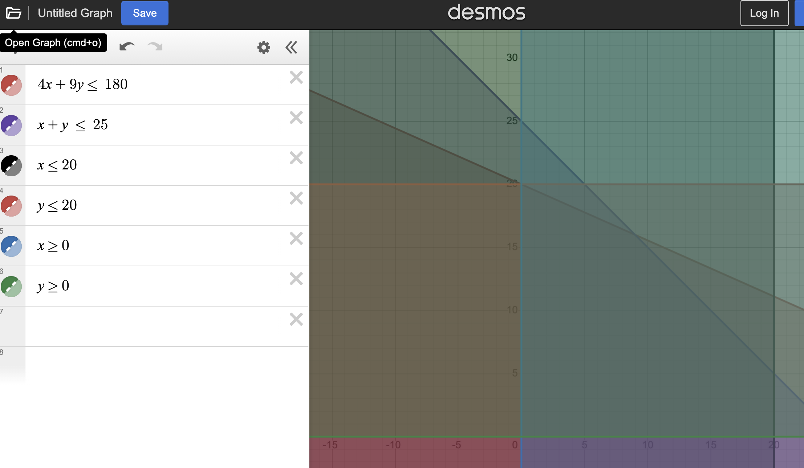
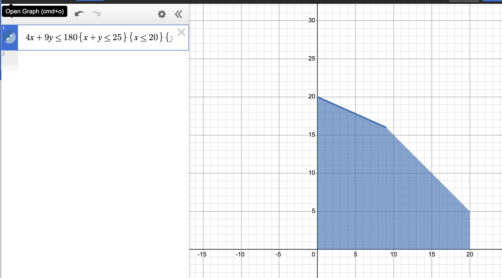

# Finish
* Donovan Meets the Beatles (1B hasn't started)
* Heavy Flying

# Start
* Ideas for solving systems 
* Programming Puzzles 65* (Portfolio)
* Finding Corners Without the Graph 20

# Programming Puzzles Problem #1 notes

Here is what happens if you graph all the constraints in Desmos:

Here is what it looks like when you graph them together in curly braces:

The shaded part is called the **feasible region.**
