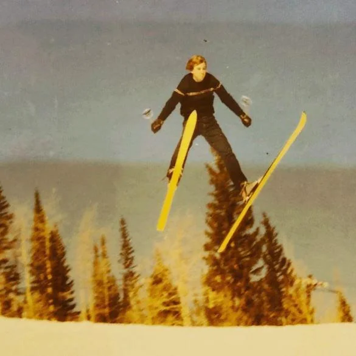
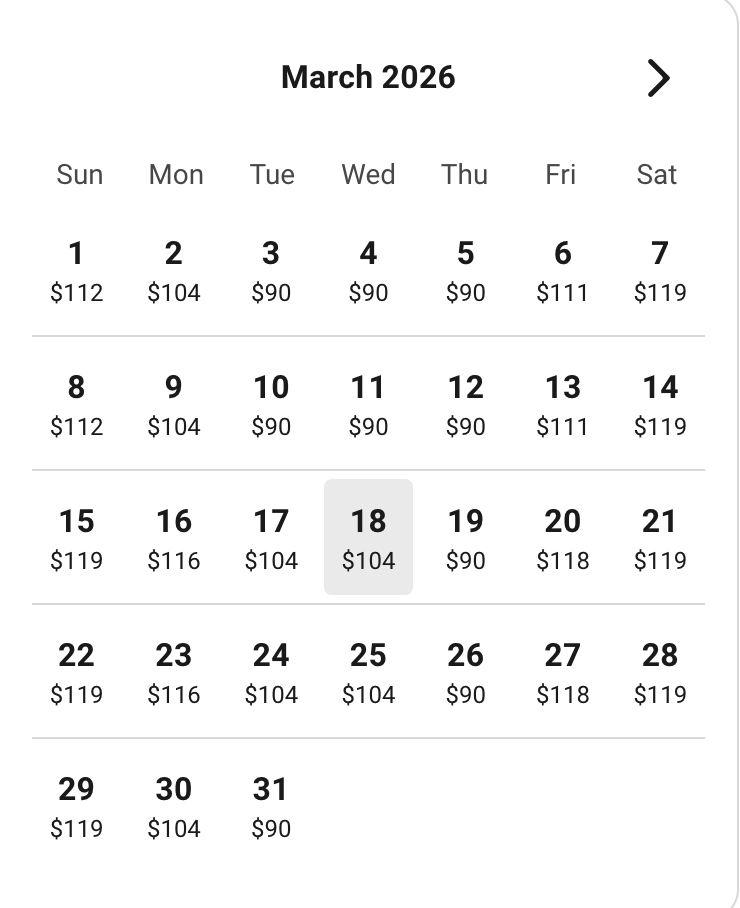

# Ski trip

## Description

Welcome to Ski Week!! You're invited to join guides on a ski-tastic adventure. From beginner to expert, skiers and snowboarders of all skill levels are welcome. On this accelerator, we will spend 3 days on the slopes at Loveland Ski Area. Students are invited to bring their own supplies or rent for the week. Come prepared to shred & have a great adventure!

## Cost: FOR TRANSPORTATION ONLY: $112.50

Important: The fee ONLY includes transportation to Loveland. Gear rentals and Ski passes are your responsiblilty and could cost up to 500.00!

## Permission slip:

[Link to permission slip](https://permission-slip.com)

## Loveland Ski Area:

Go to [Loveland Ski Area](https://skiloveland.com/) to buy passes.

Loveland Ski Area consists of the Valley and the Basin. The Valley is for beginners. If you have never skiied a blue (intermediate) run before, you will want to buy tickets for the Valley. If you are going to be skiing blues and above, you will want the Basin.

Passes are about $100 per day for the Basin, and are $50 for the Valley. Basin passes vary based on the day of the week.

Their rental packages are $55 per day.
